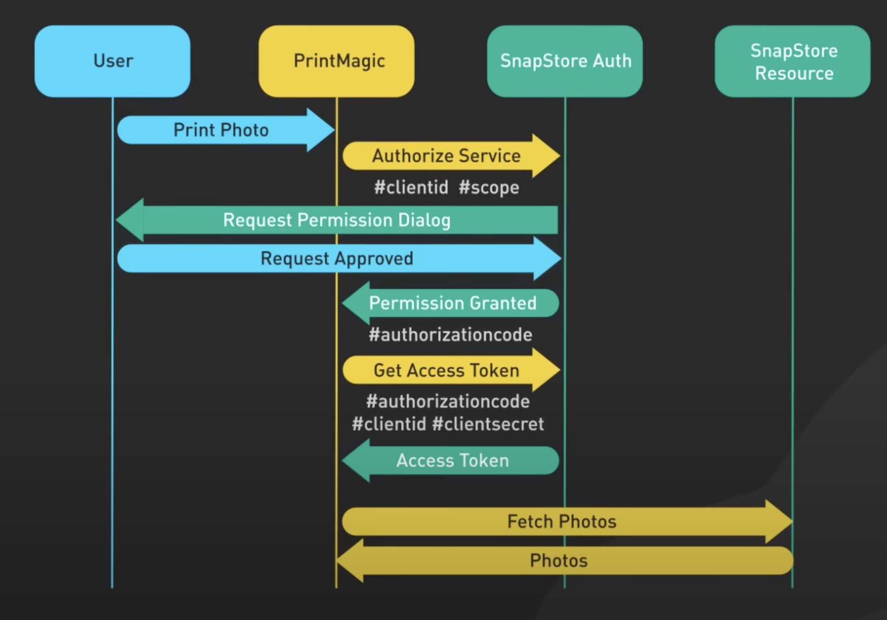
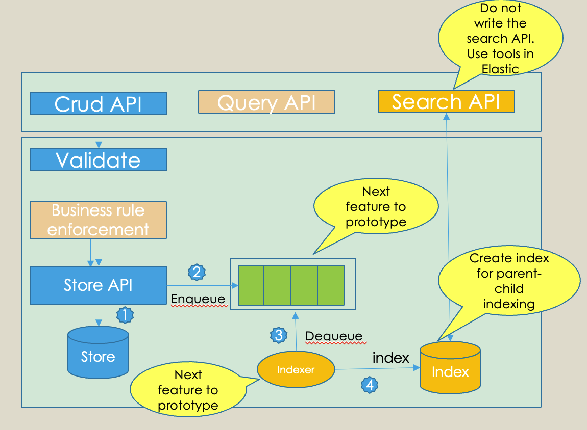

# SpringbootMedicalPlanApp
## what is Oauth2.0


## Overall architecture


## Pre-requisites
Java
Maven
OAuth 2.0 client (Refer Google APIs for more details)

## Connect to Redis server
1. Check Redis Installation: In the Terminal window, type the following command and press Enter:
```cd /opt/homebrew/bin/```(this is where your server installed)
2. type in ```redis-server```

After starting the server, kick off the CLI:
1. ```redis-cli```
2. query for all the data: ```KEYS *```

## Kafka installation
1. Install Kafka```brew install kafka```
2. Apache Kafka depends on Zookeeper for cluster management. Hence, prior to starting Kafka, Zookeeper has to be started. 
```/opt/homebrew/opt/kafka/bin/kafka-server-start /opt/homebrew/etc/zookeeper/zoo.cfg```
3. Start Kafka
```brew services start kafka```
4. Start Zookeeper
```brew services start zookeeper```
5. Create topic(in `/opt/homebrew/opt/kafka/bin`)
```kafka-topics --create --topic info7255 --bootstrap-server localhost:9092```

## Future improvement
Avoid storing "（quotation mark）in ETag